# Laravel Controllers & REST API – cvičenie

---

# Controllers & REST API – Laravel

Projekt demonštruje rôzne typy controllerov v Laraveli:
- RPC controller
- Single Action Controller
- REST controller
- REST API controller

Endpointy boli testované pomocou nástroja Postman.

---

## 1. RPC Controller `BookRpcController`


### POST /rpc/books/{id}/borrow

**Popis:** Požičanie knihy podľa ID.

```
http://localhost:8000/api/rpc/books/1/borrow?user_id=5
```

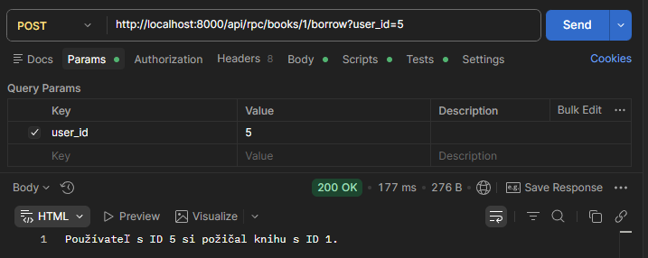

---

### POST /rpc/books/{id}/return

**Popis:** Vrátenie knihy podľa ID.
```
http://localhost:8000/api/rpc/books/1/return?condition=dobrá
```
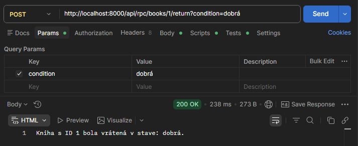

---

## 2. SAC Controller `BookSacController`

### GET /sac/books/{id}

**Popis:** Zobrazenie knihy podľa ID pomocou Single Action Controller.

```
http://localhost:8000/api/sac/books/1?format=A4
```

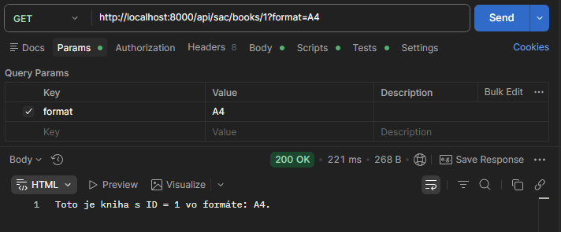

---

## 3. REST Controller `BookRestController`

### GET /rest/books

**Popis:** Získanie zoznamu všetkých kníh.

```
http://localhost:8000/api/rest/books
```

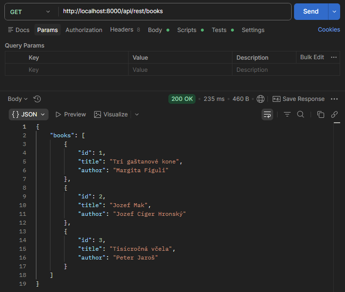

---

### GET /rest/books/create

**Popis:** Zobrazenie formulára na vytvorenie novej knihy.

```
http://localhost:8000/api/rest/books/create
```

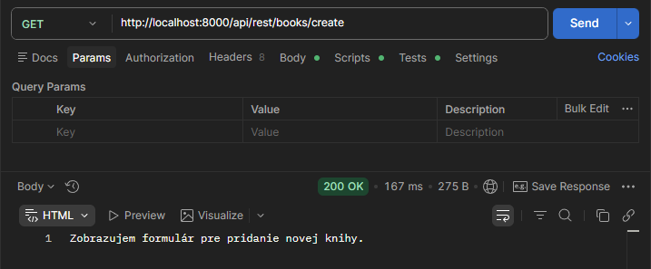

---

### GET /rest/books/{id}

**Popis:** Zobrazenie detailu knihy podľa ID.

```
http://localhost:8000/api/rest/books/5
```

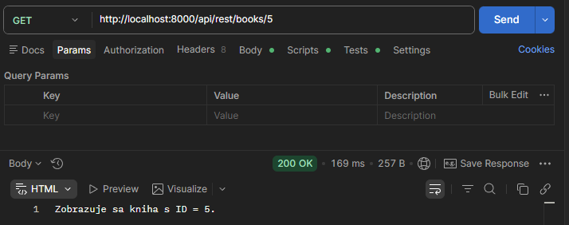

---

### POST /rest/books

**Popis:** Vytvorenie novej knihy.

```
http://localhost:8000/api/rest/books?title=Dobrodružstvá
```

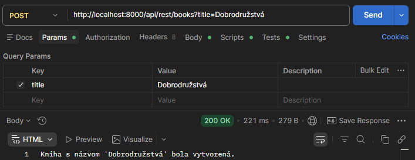

---

### PUT /rest/books/{id}

**Popis:** Aktualizácia existujúcej knihy.

```
http://localhost:8000/api/rest/books/7?title=Piesne&author=Karol Pečienka
```

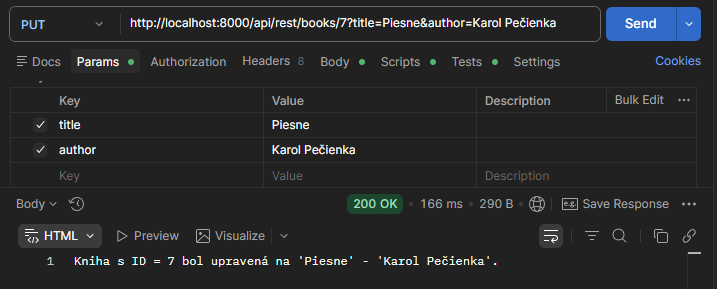

---

### DELETE /rest/books/{id}

**Popis:** Zmazanie knihy podľa ID.

```
http://localhost:8000/api/rest/books/8
```

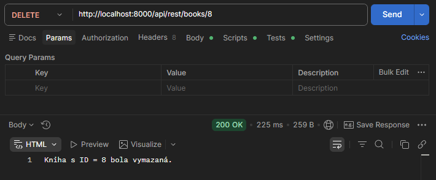

---

### GET /rest/books/{id}/edit

**Popis:** Zobrazenie formulára na úpravu knihy.

```
http://localhost:8000/api/rest/books/2/edit
```

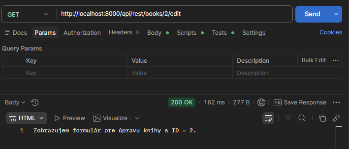
---
## 4. REST API Controller `BookApiController`

### GET /restapi/books

**Popis:** Získanie zoznamu všetkých kníh vo formáte JSON.

```
http://localhost:8000/api/restapi/books
```

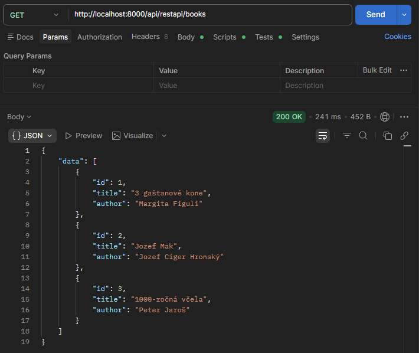

---

### GET /restapi/books/{id}

**Popis:** Zobrazenie detailu knihy.

```
http://localhost:8000/api/restapi/books/2
```

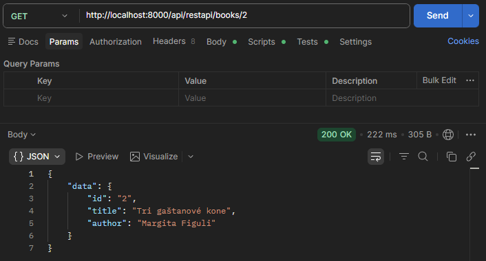

---

### POST /restapi/books

**Popis:** Vytvorenie novej knihy cez REST API.

```
http://localhost:8000/api/restapi/books?title=Dobrodružstvá&author=Karel Čapek
```

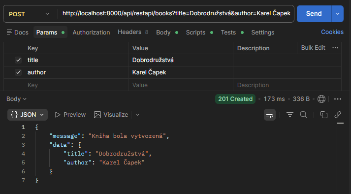

---

### PUT /restapi/books/{id}

**Popis:** Aktualizácia existujúcej knihy.

```
http://localhost:8000/api/restapi/books/2?title=Ano&author=Milan Rúfus
```

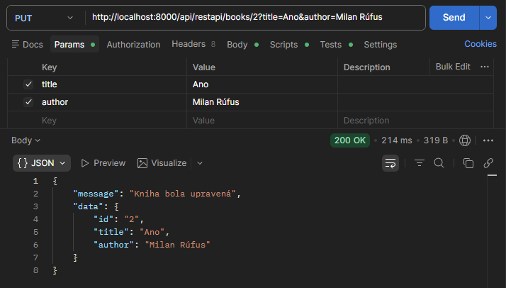

---

### DELETE /restapi/books/{id}

**Popis:** Zmazanie knihy podľa ID.

```
http://localhost:8000/api/restapi/books/2
```

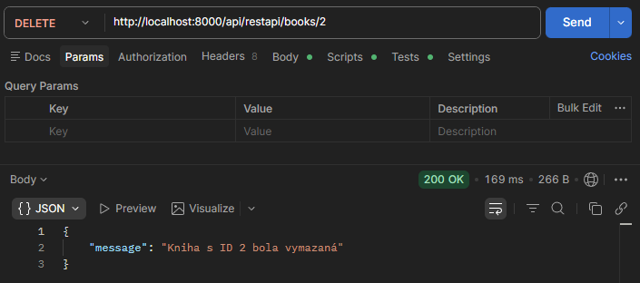

---

## Testovanie

Všetky endpointy boli testované pomocou nástroja **Postman**.

Screenshoty obsahujú:
- HTTP metódu
- URL endpointu
- telo požiadavky (ak existuje)
- odpoveď servera
- HTTP status kód

---

# Úloha – Koľko je hodín?

Cieľom úlohy bolo vytvoriť dva rôzne controllery, ktoré spracujú požiadavku na získanie aktuálneho času.

Použité boli:

- REST API Controller
- RPC Controller
- vlastná služba **TimeService**
- Dependency Injection

Aplikácia vracia aktuálny dátum a čas vo formáte: Y-m-d H:i:s

## 1. REST API Controller `TimeApiController`

### GET /restapi/time

**Popis:** Vracia aktuálny čas v JSON formáte.

```
http://localhost:8000/api/restapi/time
```

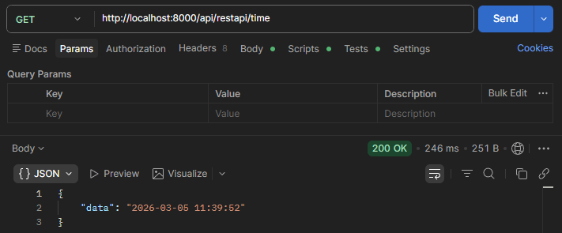

---

## 2. RPC Controller `TimeRpcController`


### GET /rpc/time

**Popis:** Vracia aktuálny čas ako plaintext odpoveď.

```
http://localhost:8000/api/rpc/time
```

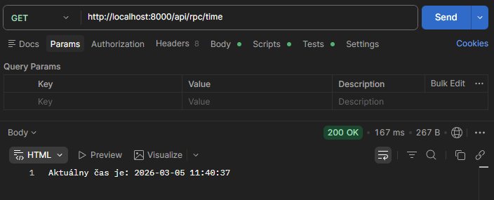

---
